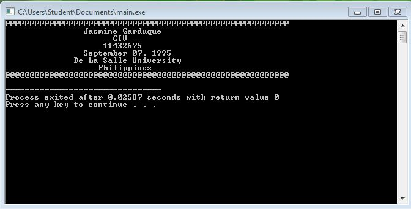
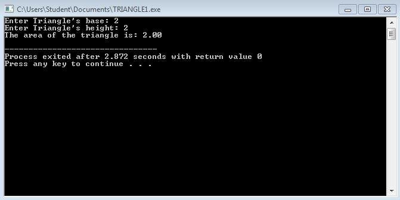
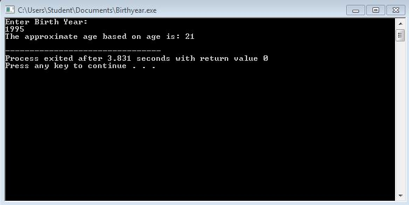
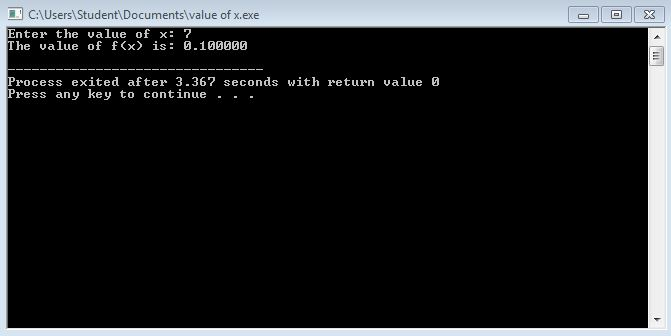

# Activity1-GarduqueJ

```
#include <stdio.h>
#include <stdlib.h>

int main() {
	printf("@@@@@@@@@@@@@@@@@@@@@@@@@@@@@@@@@@@@@@@@@@@@@@@@@@@@@@@@@@\n");
	printf("\t\tJasmine Garduque\n");
	printf("\t\t      CIV\n");
	printf("\t\t    11432675\n");
	printf("\t\tSeptember 07, 1995\n");
	printf("\t      De La Salle University\n");
	printf("\t\t   Philippines\n");
	printf("@@@@@@@@@@@@@@@@@@@@@@@@@@@@@@@@@@@@@@@@@@@@@@@@@@@@@@@@@@\n");


	return 0;
}

```



```

#include <stdio.h>
#include <stdlib.h>

int main() 
{
	int b, h;
	float a;
	printf("Enter Triangle's base: ");
	scanf("%d", &b);
	printf("Enter Triangle's height: ");
	scanf("%d", &h);	
	
	a=b*h/2;
	printf("The area of the triangle is: %.2f\n", a);
	
	return 0;
}

```



```

#include <stdio.h>
#include <stdlib.h>


int main() 
{
	int yr;
	float n;
	printf("Enter Birth Year: \n");
	scanf("%d", &yr);
	
    n = 2016 - yr;
		
	printf("The approximate age based on age is: %0.0f\n", n);
	
	return 0;
}

```



```
#include <stdio.h>
#include <stdlib.h>

int main() 
{
	float x, n;
	printf("Enter the value of x: ");
	scanf("%f", &x);
	
	n=x/70;
	printf("The value of f(x) is: %f\n", n);
	
	return 0;
}

```



```
